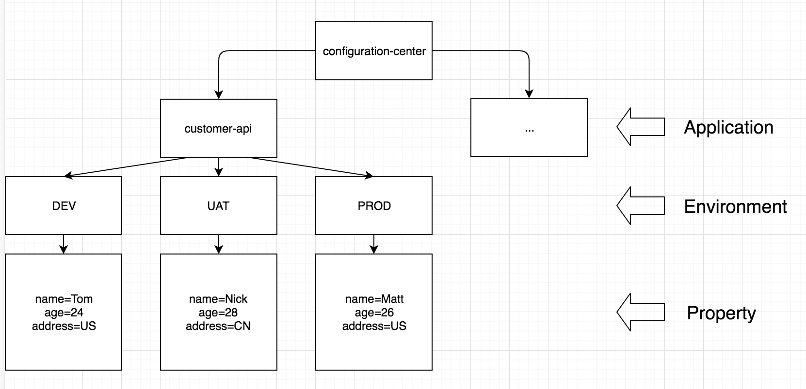

## configuration-center

configuration center is a configuration management center based on Zookeeper.
It includes the following components.

`configuration-center-api` provide an API to create/view/update/delete the config.

`configuration-center-sdk` provide a Java SDK tool to get/listen config, which can be used for non-spring application.

`spring-boot-starter-configuration-center` provide a library that integrated with Spring, which can be used for Spring boot application.

There should be a project `configuration-center-ui` to provide a ui interface to operate the config easily. But sorry, I am not familiar with front-end development.
 
## QuickStart

### Config Data Preparation
Assume there is an application called `customer-api` in `dev` environment.

Let's get zookeeper started and create some config for customer-api application.
Ideally we are supposed to create config data via `configuration-center-api`, but here let's make things simple, create data in zookeeper directly.

1. Start your zookeeper server
2. Run below command in zookeeper server to create test data.
```
create /configuration-center ""
create /configuration-center/customer-api ""
create /configuration-center/customer-api/dev ""
create /configuration-center/customer-api/dev/name "Tom"
```

As you can see, we created a config `name=Tom` for `customer-api` in `dev` environment.
The following documentation will show you how to get and listen config for non spring application & spring boot application.

### Non Spring Application
1. import `configuration-center-sdk` library
2. create `ConfigurationTemplate`
```
configurationTemplate = new ConfigurationTemplate.Builder()
        .connectionString("localhost:2181")
        .application("customer-api")
        .environment("dev")
        .sessionTimeoutMs(10000)
        .connectionTimeoutMs(10000)
        .build();
```

3. we can get the config like below.
```
String name = configurationTemplate.get("name")
```

4. Also we can listen the config update as per code below, every time `name` config updated, callback method will be invoked.
```
configurationTemplate.listen(this, "name", value -> {
    System.out.println(value);
});    
```

### Spring Boot Application
1. import `spring-boot-starter-configuration-center` library
2. add configuration center associated config in application.yml
```
configuration-center:
  application: "customer-api"
  environment: "dev"
  connectionString: "localhost:2181"
```
3. add annotation `@Config` on bean field for which you want to get value from zookeeper

```
@RestController
public class TestController {
    @Config(value = "name")
    private String name;

    @RequestMapping("/name")
    public String name() {
        return name;
    }
}
```

4. `@Config(refresh=true)` supports that real time refresh the field value as long as you update the config in zookeeper.
```
@RestController
public class TestController {
    @Config(value = "name", refresh = true)
    private String name;

    @RequestMapping("/name")
    public String name() {
        return name;
    }
}
```

## Design Documentation

### Configuration Struct
Basically configuration struct in zookeeper consists of four layers.

Top layer is configuration-center namespace, the second layer is different applications, 
the third layer is application's different environments, the last layer is detailed properties in specific environment.
 



### Failover
Configuration center has a complete failover strategy. it does not impact the application even if configuration center is down. 

1. **local memory cache**, configuration from zookeeper would be stored in memory.  
2. **local cache folder**, application would persistent the memory data into file. 
when application lost connection with configuration center and application is restarted, since there is no memory cache, application can read config from local cache file.
3. **local failover folder**, normally failover folder is empty. when application has been lost connection with configuration center for a long time, and configurations has been changed a lot, config in local cache file is out of date.
in this case, it's able to add config manually in local failover file. and application will ignore cache folder, only read config from failover folder instead.